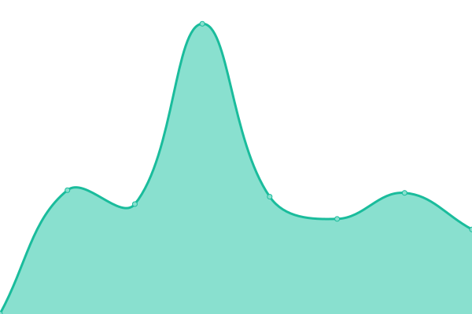

# [📈 Live Status](https://choi-spaceflo.github.io/upptime-status): <!--live status--> **🟧 Partial outage**

This repository contains the open-source uptime monitor and status page for [Choi at Spaceflo](https://choi-spaceflo.github.io/uptime-status), powered by [Upptime](https://github.com/upptime/upptime).

With [Upptime](https://upptime.js.org), you can get your own unlimited and free uptime monitor and status page, powered entirely by a GitHub repository. We use [Issues](https://github.com/choi-spaceflo/uptime-status/issues) as incident reports, [Actions](https://github.com/choi-spaceflo/upptime-status/actions) as uptime monitors, and [Pages](https://choi-spaceflo.github.io/uptime-status) for the status page.

<!--start: status pages-->
<!-- This summary is generated by Upptime (https://github.com/upptime/upptime) -->
<!-- Do not edit this manually, your changes will be overwritten -->
<!-- prettier-ignore -->
| URL | Status | History | Response Time | Uptime |
| --- | ------ | ------- | ------------- | ------ |
|  [u12](https://unicornvalley.io) | 🟩 Up | [u12.yml](https://github.com/choi-spaceflo/uptime-status/commits/HEAD/history/u12.yml) | 

 614ms
     
 | 

<a href="https://choi-spaceflo.github.io/uptime-status/history/u12">100.00%</a>
    

|  [spaceflo](https://spaceflo.io) | 🟩 Up | [spaceflo.yml](https://github.com/choi-spaceflo/uptime-status/commits/HEAD/history/spaceflo.yml) | 

 542ms
     
 | 

<a href="https://choi-spaceflo.github.io/uptime-status/history/spaceflo">100.00%</a>
    

|  [injobfit](https://sub.injobfit.com) | 🟥 Down | [injobfit.yml](https://github.com/choi-spaceflo/uptime-status/commits/HEAD/history/injobfit.yml) | 

 0ms
     
 | 

<a href="https://choi-spaceflo.github.io/uptime-status/history/injobfit">0.00%</a>
    

|  [ritzbrooks](https://ritzbrooks.com) | 🟩 Up | [ritzbrooks.yml](https://github.com/choi-spaceflo/uptime-status/commits/HEAD/history/ritzbrooks.yml) | 

 542ms
     
 | 

<a href="https://choi-spaceflo.github.io/uptime-status/history/ritzbrooks">100.00%</a>
    

|  [poinex](https://poinex.co.kr) | 🟩 Up | [poinex.yml](https://github.com/choi-spaceflo/uptime-status/commits/HEAD/history/poinex.yml) | 

 2043ms
     
 | 

<a href="https://choi-spaceflo.github.io/uptime-status/history/poinex">99.52%</a>
    

|  [welcomeskinfit](https://welcomeskinfit.com) | 🟩 Up | [welcomeskinfit.yml](https://github.com/choi-spaceflo/uptime-status/commits/HEAD/history/welcomeskinfit.yml) | 

 459ms
     
 | 

<a href="https://choi-spaceflo.github.io/uptime-status/history/welcomeskinfit">100.00%</a>
    

|  [startupskku](http://startup.skku.edu) | 🟩 Up | [startupskku.yml](https://github.com/choi-spaceflo/uptime-status/commits/HEAD/history/startupskku.yml) | 

 2868ms
     
 | 

<a href="https://choi-spaceflo.github.io/uptime-status/history/startupskku">100.00%</a>
    

|  [ohmybot.co](https://ohmybot.co) | 🟩 Up | [ohmybot-co.yml](https://github.com/choi-spaceflo/uptime-status/commits/HEAD/history/ohmybot-co.yml) | 

 395ms
     
 | 

<a href="https://choi-spaceflo.github.io/uptime-status/history/ohmybot-co">100.00%</a>
    

|  [ohmybot.team](https://ohmybot.team) | 🟩 Up | [ohmybot-team.yml](https://github.com/choi-spaceflo/uptime-status/commits/HEAD/history/ohmybot-team.yml) | 

 738ms
     
 | 

<a href="https://choi-spaceflo.github.io/uptime-status/history/ohmybot-team">100.00%</a>
    

|  [demo1.ohmybot.team](https://demo1.ohmybot.team) | 🟩 Up | [demo1-ohmybot-team.yml](https://github.com/choi-spaceflo/uptime-status/commits/HEAD/history/demo1-ohmybot-team.yml) | 

 1037ms
     
 | 

<a href="https://choi-spaceflo.github.io/uptime-status/history/demo1-ohmybot-team">97.79%</a>
    

|  [skindoctork.com](https://skindoctork.com) | 🟩 Up | [skindoctork-com.yml](https://github.com/choi-spaceflo/uptime-status/commits/HEAD/history/skindoctork-com.yml) | 

 829ms
     
 | 

<a href="https://choi-spaceflo.github.io/uptime-status/history/skindoctork-com">100.00%</a>
    

|  [47.u12.io](https://47.u12.io) | 🟩 Up | [47-u12-io.yml](https://github.com/choi-spaceflo/uptime-status/commits/HEAD/history/47-u12-io.yml) | 

 421ms
     
 | 

<a href="https://choi-spaceflo.github.io/uptime-status/history/47-u12-io">100.00%</a>
    

<!--end: status pages-->

[**Visit our status website →**](https://choi-spaceflo.github.io/uptime-status)

## 📄 License

- Powered by: [Upptime](https://github.com/upptime/upptime)
- Code: [MIT](./LICENSE) © [Choi at Spaceflo](https://choi-spaceflo.github.io/uptime-status)
- Data in the `./history` directory: [Open Database License](https://opendatacommons.org/licenses/odbl/1-0/)
