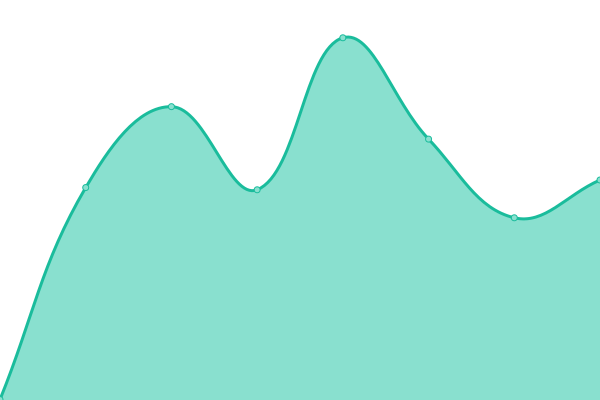
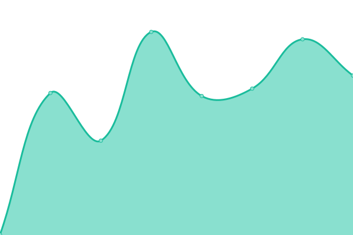
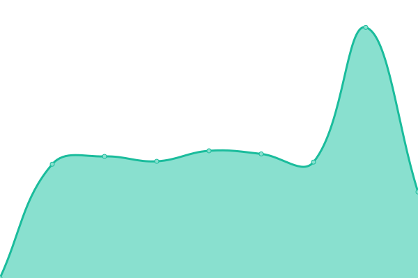

# [📈 Live Status](https://choi-spaceflo.github.io/upptime-status): <!--live status--> **🟧 Partial outage**

This repository contains the open-source uptime monitor and status page for [Choi at Spaceflo](https://choi-spaceflo.github.io/uptime-status), powered by [Upptime](https://github.com/upptime/upptime).

With [Upptime](https://upptime.js.org), you can get your own unlimited and free uptime monitor and status page, powered entirely by a GitHub repository. We use [Issues](https://github.com/choi-spaceflo/uptime-status/issues) as incident reports, [Actions](https://github.com/choi-spaceflo/upptime-status/actions) as uptime monitors, and [Pages](https://choi-spaceflo.github.io/uptime-status) for the status page.

<!--start: status pages-->
<!-- This summary is generated by Upptime (https://github.com/upptime/upptime) -->
<!-- Do not edit this manually, your changes will be overwritten -->
<!-- prettier-ignore -->
| URL | Status | History | Response Time | Uptime |
| --- | ------ | ------- | ------------- | ------ |
|  [u12](https://unicornvalley.io) | 🟩 Up | [u12.yml](https://github.com/choi-spaceflo/uptime-status/commits/HEAD/history/u12.yml) | 

 561ms
     
 | 

<a href="https://choi-spaceflo.github.io/uptime-status/history/u12">100.00%</a>
    

|  [qa-u12](https://qa.unicornvalley.io) | 🟩 Up | [qa-u12.yml](https://github.com/choi-spaceflo/uptime-status/commits/HEAD/history/qa-u12.yml) | 

 580ms
     
 | 

<a href="https://choi-spaceflo.github.io/uptime-status/history/qa-u12">100.00%</a>
    

|  [test-u12](https://test.unicornvalley.io/) | 🟩 Up | [test-u12.yml](https://github.com/choi-spaceflo/uptime-status/commits/HEAD/history/test-u12.yml) | 

 772ms
     
 | 

<a href="https://choi-spaceflo.github.io/uptime-status/history/test-u12">100.00%</a>
    

|  [sesdashboard](https://sesdashboard.u12.io) | 🟩 Up | [sesdashboard.yml](https://github.com/choi-spaceflo/uptime-status/commits/HEAD/history/sesdashboard.yml) | 

 821ms
     
 | 

<a href="https://choi-spaceflo.github.io/uptime-status/history/sesdashboard">100.00%</a>
    

|  [spaceflo](https://spaceflo.io) | 🟩 Up | [spaceflo.yml](https://github.com/choi-spaceflo/uptime-status/commits/HEAD/history/spaceflo.yml) | 

 554ms
     
 | 

<a href="https://choi-spaceflo.github.io/uptime-status/history/spaceflo">100.00%</a>
    

|  [injobfit](https://sub.injobfit.com) | 🟩 Up | [injobfit.yml](https://github.com/choi-spaceflo/uptime-status/commits/HEAD/history/injobfit.yml) | 

 949ms
     
 | 

<a href="https://choi-spaceflo.github.io/uptime-status/history/injobfit">100.00%</a>
    

|  [ritzbrooks](https://ritzbrooks.com) | 🟩 Up | [ritzbrooks.yml](https://github.com/choi-spaceflo/uptime-status/commits/HEAD/history/ritzbrooks.yml) | 

 503ms
     
 | 

<a href="https://choi-spaceflo.github.io/uptime-status/history/ritzbrooks">100.00%</a>
    

|  [dkhc](https://dkhc.kr) | 🟩 Up | [dkhc.yml](https://github.com/choi-spaceflo/uptime-status/commits/HEAD/history/dkhc.yml) | 

 555ms
     
 | 

<a href="https://choi-spaceflo.github.io/uptime-status/history/dkhc">100.00%</a>
    

|  [poinex](https://poinex.co.kr) | 🟥 Down | [poinex.yml](https://github.com/choi-spaceflo/uptime-status/commits/HEAD/history/poinex.yml) | 

 2064ms
     
 | 

<a href="https://choi-spaceflo.github.io/uptime-status/history/poinex">100.00%</a>
    

|  [welcomeskinfit](https://welcomeskinfit.com) | 🟩 Up | [welcomeskinfit.yml](https://github.com/choi-spaceflo/uptime-status/commits/HEAD/history/welcomeskinfit.yml) | 

 477ms
     
 | 

<a href="https://choi-spaceflo.github.io/uptime-status/history/welcomeskinfit">100.00%</a>
    

|  [startupskku](http://startup.skku.edu) | 🟩 Up | [startupskku.yml](https://github.com/choi-spaceflo/uptime-status/commits/HEAD/history/startupskku.yml) | 

 3400ms
     
 | 

<a href="https://choi-spaceflo.github.io/uptime-status/history/startupskku">97.81%</a>
    

<!--end: status pages-->

[**Visit our status website →**](https://choi-spaceflo.github.io/uptime-status)

## 📄 License

- Powered by: [Upptime](https://github.com/upptime/upptime)
- Code: [MIT](./LICENSE) © [Choi at Spaceflo](https://choi-spaceflo.github.io/uptime-status)
- Data in the `./history` directory: [Open Database License](https://opendatacommons.org/licenses/odbl/1-0/)
