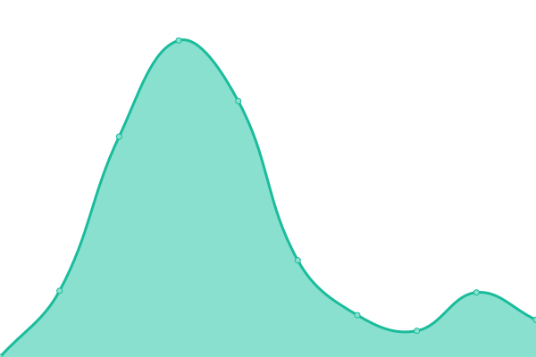

# [📈 Live Status](https://choi-spaceflo.github.io/upptime-status): <!--live status--> **🟧 Partial outage**

This repository contains the open-source uptime monitor and status page for [Choi at Spaceflo](https://choi-spaceflo.github.io/uptime-status), powered by [Upptime](https://github.com/upptime/upptime).

With [Upptime](https://upptime.js.org), you can get your own unlimited and free uptime monitor and status page, powered entirely by a GitHub repository. We use [Issues](https://github.com/choi-spaceflo/uptime-status/issues) as incident reports, [Actions](https://github.com/choi-spaceflo/upptime-status/actions) as uptime monitors, and [Pages](https://choi-spaceflo.github.io/uptime-status) for the status page.

<!--start: status pages-->
<!-- This summary is generated by Upptime (https://github.com/upptime/upptime) -->
<!-- Do not edit this manually, your changes will be overwritten -->
<!-- prettier-ignore -->
| URL | Status | History | Response Time | Uptime |
| --- | ------ | ------- | ------------- | ------ |
|  [pve1](https://pve1.spaceflo.io) | 🟥 Down | [pve1.yml](https://github.com/choi-spaceflo/uptime-status/commits/HEAD/history/pve1.yml) | 

 533ms
     
 | 

<a href="https://choi-spaceflo.github.io/uptime-status/history/pve1">0.00%</a>
    

|  [proxy-svr](https://cp100.spaceflo.io) | 🟥 Down | [proxy-svr.yml](https://github.com/choi-spaceflo/uptime-status/commits/HEAD/history/proxy-svr.yml) | 

 503ms
     
 | 

<a href="https://choi-spaceflo.github.io/uptime-status/history/proxy-svr">0.00%</a>
    

|  [cpseoul](https://cpseoul.spaceflo.io) | 🟩 Up | [cpseoul.yml](https://github.com/choi-spaceflo/uptime-status/commits/HEAD/history/cpseoul.yml) | 

 877ms
     
 | 

<a href="https://choi-spaceflo.github.io/uptime-status/history/cpseoul">100.00%</a>
    

<!--end: status pages-->

[**Visit our status website →**](https://choi-spaceflo.github.io/uptime-status)

## 📄 License

- Powered by: [Upptime](https://github.com/upptime/upptime)
- Code: [MIT](./LICENSE) © [Choi at Spaceflo](https://choi-spaceflo.github.io/uptime-status)
- Data in the `./history` directory: [Open Database License](https://opendatacommons.org/licenses/odbl/1-0/)
